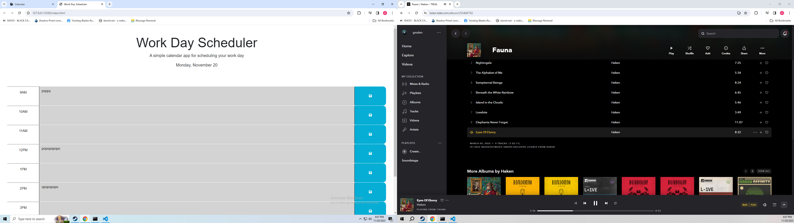

# Scheduler

## Image

## Description

This was an excercise in javascript logic.  A script was written to create a scheduler that dynamically changed based on time of day.  It also stored values into local storage so they would be present after refresh.

## Installation

Stylesheet and script are located in the assets folder.

## Licensing

MIT